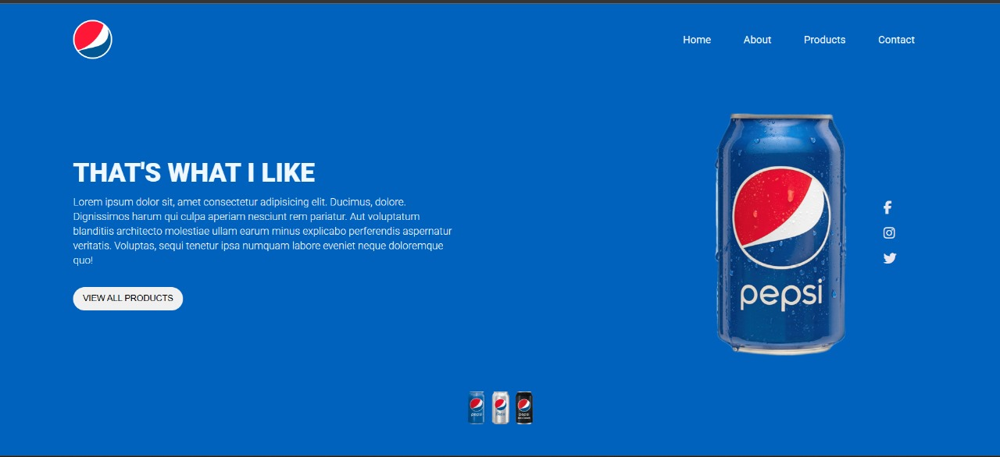

# 🥤 Pepsi Landing Page

A modern, responsive Pepsi landing page clone built using **HTML**, **CSS**, and **Font Awesome** icons.  
This project showcases clean layout, stylish animation, and smooth responsiveness — perfect for frontend practice and UI presentation.

## 📸 Screenshots

 <!-- *you can replace this with an actual screenshot or GitHub will show broken image* -->

## 🌟 Features

- 🍭 Smooth entrance animations with `@keyframes`
- 🎨 Fully responsive layout for mobile and desktop
- 🧭 Navbar with logo and basic navigation links
- 🧃 Eye-catching hero section with Pepsi branding
- 🔗 Social media icons with hover effects
- 🥫 Footer with animated Pepsi cans

## 📁 Project Structure


## 🛠️ Technologies Used

- HTML5
- CSS3
- Font Awesome CDN
- Google Fonts (Roboto)

## 📱 Responsive Design

This landing page is designed to work seamlessly on all screen sizes including mobile devices. Media queries are included for breakpoints at `600px` and `900px`.

## 🚀 How to Use

1. Clone the repository:
   ```bash
   git clone https://github.com/AymanSha3ban/Pepsi.git

---

## 🔽 الخطوة الجاية:

- احفظ النص ده في ملف جديد اسمه `README.md` داخل فولدر المشروع.
- وبعد كده اعمل:
  ```bash
  git add README.md
  git commit -m "Add professional README file"
  git push origin main
